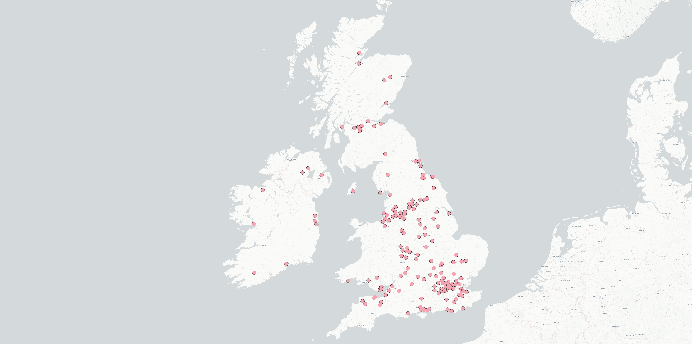
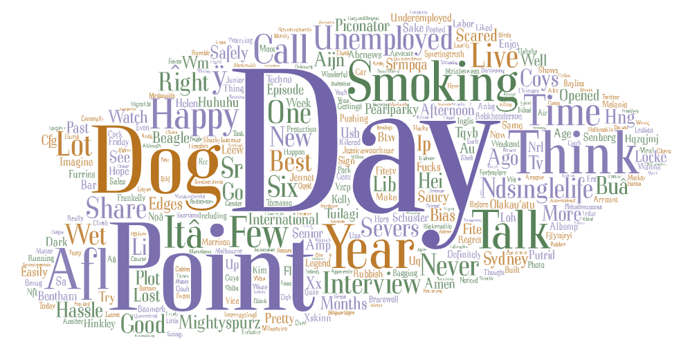

# Lab 2: Geo-tagged tweet collection and visualization

**Instructor:** Bo Zhao, 206.685.3846 or zhaobo@uw.edu; **Points Available** = 50

These are two screenshots of the twitter usage of Australia and the UK at 11:00 PM PST 4/21/22. 

As you can see from the maps, the UK used twitter a large amount more during the 5 minutes the bot was active. This may be due to simple demographics, as the UK has around 16 million active twitter users, while australia has just under 3 million. This was still an interesting thing to graph, as it shows the relatively small population of australia, despite its large landmass. Furthermore, while in australia it was around 4:00 PM, in the UK it was around 7:00 AM, before most people were awake. This suggests if we normalized the relative times and graphed them both at noon, this distance between the tweets from the UK and the tweets from Australia would only increase. 

Furthermore, when we look at the word art comparison between the two we can also see some differences. The most obvious one is the time difference being very visible, with the UK greeting the day with good mornings, bad mornings, and all types of other morning-related messages. However, Australia is discussing in general how the day is going and other messages fitting for the end of the day. It is a shame that due to the web-scraping software, we cannot get a grasp on the emojis that were used, as I had to prune them from the word clouds due to them turning into gibberish unicode, but I have hope that we can make it work in the future. 

